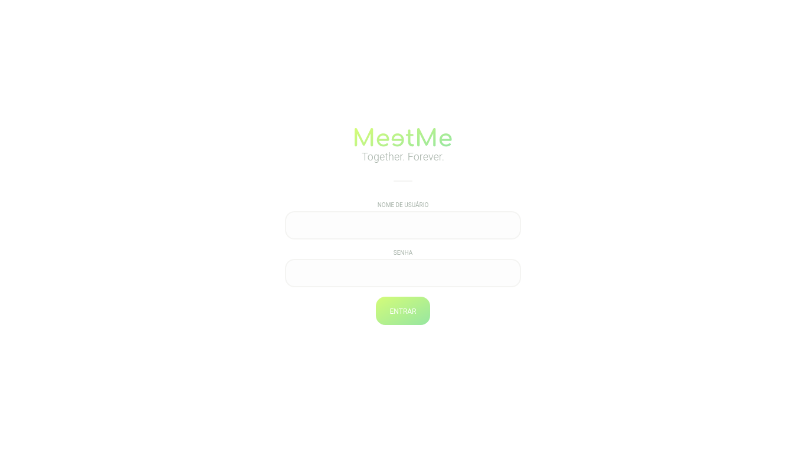
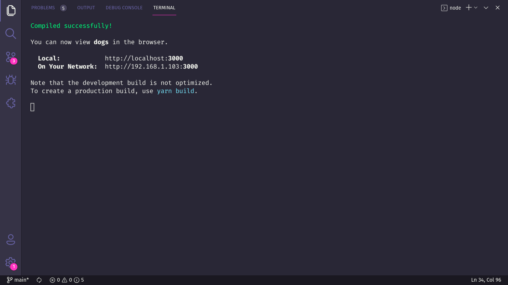

# :handshake: MeetMe

> This project was developed as the final work of the Object Oriented Programming 1 subject of the Computer Science course at UFU.

## :dart: Goal

Matching events with your friends has never been easier! MeetMe is here to help you match event schedules, avoiding conflicts and headaches.

## :scroll: Some details

- The backend is built with Java and Spring Boot.
- The fontend is built with ReactJS.

## :thinking: How do I run the project on my machine?

The first step is to clone the project, either via terminal or GitHub Desktop, or even by downloading the compressed file (.zip). After that, go ahead.

### :hammer_and_wrench: Requirements

- [Node.JS](https://nodejs.org/).
- [Netbeans](https://netbeans.apache.org/).
- (Optional) [Yarn](https://yarnpkg.com/).

### :mag: Installing dependencies

#### Backend

Open the project in Netbeans. A warning window will appear indicating that there are problems (missing dependencies). Just click on "Resolve problems" and "Resolve" in the next window that opens and wait a few moments until there is an indication that all dependencies have been installed.

#### Frontend

With Node.JS installed, access the **frontend** directory via terminal and run the `npm install` command. If you prefer to use Yarn, just run the `yarn` command.

### :goggles: Running the Backend

With the project open in Netbeans, look for the file called `MeetMeWeb.java` and run it.

### :sparkles: Running the Frontend

With the dependencies properly installed, still in the terminal, run `npm start` or ` yarn start`. A message similar to the following will appear for you:

Now just access the address _http://localhost:3000_ in your favorite browser, to see the project running.

> If this was not the result, check that the requirements and previous steps have been fulfilled.

### :tada: If everything went well...

Now you are running the project beautifully!
