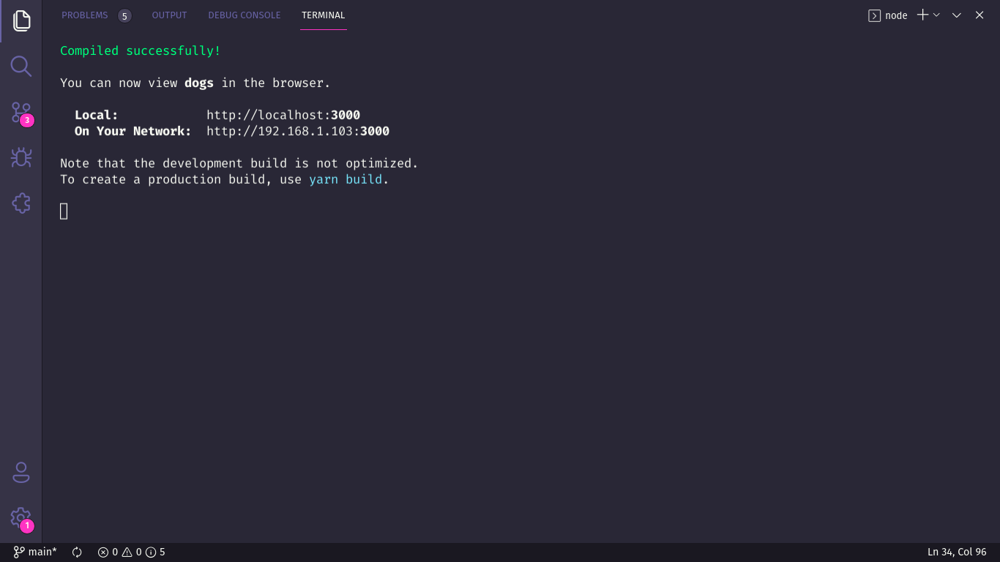

# :handshake: MeetMe

> Esse projeto foi desenvolvido como trabalho final da disciplina Programação Orientada a Objetos 1 do curso de Ciência da Computação na UFU.

## :dart: Objetivo

Combinar eventos com seus amigos nunca foi tão fácil! O MeetMe chega para te ajudar a compatibilizar horários de eventos, evitando conflitos e dor de cabeça.

## :scroll: Some details

- O backend é construído em Java e Spring Boot.
- O fontend é construído com ReactJS.

## :thinking: Como executo o projeto na minha máquina?

O primeiro passo é clonar o projeto, seja via terminal ou GitHub Desktop, ou ainda baixando o arquivo compactado (.zip). Depois disso, vá em frente.

### :hammer_and_wrench: Requisitos

- [Node.JS](https://nodejs.org/).
- [Netbeans](https://netbeans.apache.org/).
- (Opcional) [Yarn](https://yarnpkg.com/).

### :mag: Instalando dependências

#### Backend

Abra o projeto no Netbeans. Uma janela de avisos aparecerá indicando que há problemas (dependências faltantes). Basta clicar em "Resolver problemas", e em "Resolver" na próxima janela que se abre e aguarde alguns instantes até houver uma indicação de que todas as dependências foram instaladas.

#### Frontend

Com o Node.JS instalado, acesse o diretório **frontend** via terminal e execute o comando `npm install`. Se você preferir usar o Yarn, basta executar o comando `yarn`.

### :goggles: Rodando o Backend

Com o projeto aberto no Netbeans, procure pelo arquivo chamado `MeetMeWeb.java` e executá-lo.

### :sparkles: Rodando o Frontend

Com as dependências devidamente instaladas, ainda no terminal, execute `npm start` ou` yarn start`. Uma mensagem semelhante à seguinte aparecerá para você:

Agora é só acessar o endereço _http://localhost:3000_ no seu navegador favorito, para ver o projeto rodando.

> Caso contrário, verifique se os requisitos e etapas anteriores foram atendidos.

### :tada: Se tudo correu bem...

Agora você está executando o projeto lindamente!
